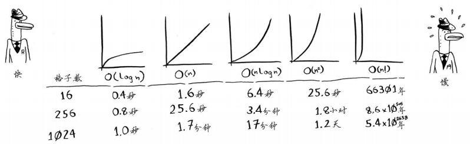

# grokking-algorithem

Reading note of grokking algorithem

## Chapter 01: 算法简介

二分查找，时间复杂度 O(logn)

1. 有序元素列表
1. 有则返回结果，没有则返回null

对数是幂运算的逆运算

大O表示法指出了最糟情况下的运行时间

常见的几种大O运行时间：

1. O(logn) 对数时间 - 二分查找
1. O(n) 线性时间 - 简单查找
1. O(n*logn) 快速排序 - 较快的排序
1. O(n2) 选择排序 - 较慢的排序
1. O(n!) 旅行商问题 - 非常慢

* 算法的速度指的并不是时间，而是操作数的增速
* 谈论算法的速度时，我们说的是随着输入的增加，运行时间将以什么样的速度增加
* 算法的运行时间用O表示法表示
* O(logn)比O(n)快，当搜索元素越多时，越明显
