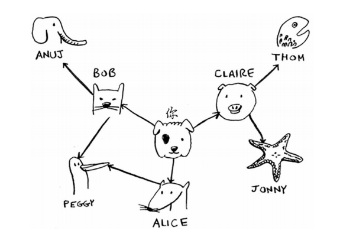
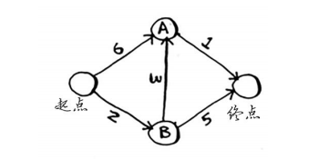
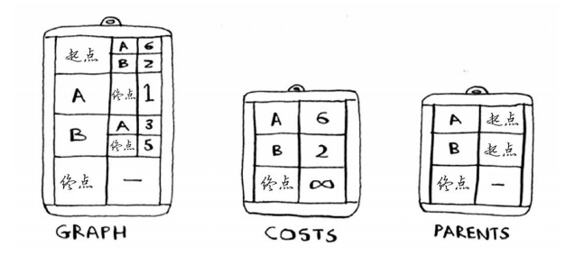
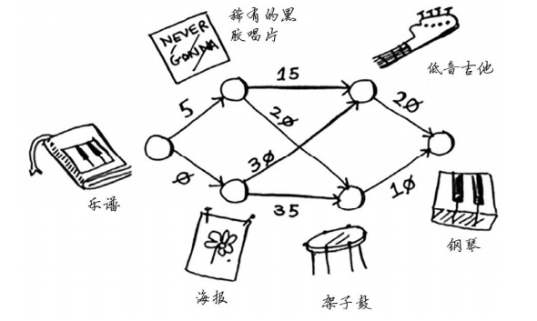

# grokking-algorithem

Reading note of grokking algorithem

## Chapter 01: 算法简介

二分查找，时间复杂度 O(logn)

1. 有序元素列表
1. 有则返回结果，没有则返回null

对数是幂运算的逆运算

大O表示法指出了最糟情况下的运行时间

常见的几种大O运行时间：

1. O(logn) 对数时间 - 二分查找
1. O(n) 线性时间 - 简单查找
1. O(n*logn) 快速排序 - 较快的排序
1. O(n2) 选择排序 - 较慢的排序
1. O(n!) 旅行商问题 - 非常慢

* 算法的速度指的并不是时间，而是操作数的增速
* 谈论算法的速度时，我们说的是随着输入的增加，运行时间将以什么样的速度增加
* 算法的运行时间用O表示法表示
* O(logn)比O(n)快，当搜索元素越多时，越明显

## Chapter 02: 选择排序

选择排序-O(n2): 找出目标元素需要时间O(n)，这种操作需要执行n次。不是很快的一种排序方式

类比冒泡排序：两种排序O相同，但是交换策列不同，选择排序是取一个依次和后面的比，如果符合条件则交换，冒泡的话是如果符合条件，交换相邻的两个元素

## Chapter 03: 递归

递归函数：基线条件(base case) + 递归条件(recursive case)

递归条件：函数调用自己， 基线条件：函数不再调用自己

## Chapter 04: 快速排序

D&C - divide and conquer

例1：168m * 64m 的田地，把他均匀的分成方块，方块尽可能大，最大的变长是多少

例2：使用递归求数组和

例3：快速排序

快排思路：

1. 选区基准值
1. 将数据分成： 小于基准值 + 基准值 + 大于基准值 三类
1. 对小于和大于基准值的类做快排
1. 合并结果

合并排序（merge sort）时间复杂度O(nlogn), 快速排序最坏情况O(n2), 但是快排的时间常数要比合并排序小，快排时间复杂度介于O(nlogn) - O(n2)之间

对比了一下 java 和 python 的快排实现，python 要好理解不止一点点。。。应为语法上python要简介很多，底层实现和效率就不得而知了

## Chapter 05: 散列表

散列表就是 hashmap, 一对一的数据结构，O(1), 非常快！这种数据结构通过散列函数做键的位置分配

存储键值对时的位置冲突简称 - 冲突， 冲突解决方案，使用链表。但是如果链表很长，散列表的速度会急剧下降；如果散列函数良好，链表不会很长。

* 较低的填装因子 - 散列表包含的元素总数/位置总数， 一般因子 > 0.7 就需要进行扩展了
* 良好的散列函数

## Chapter 06: 广度优先搜索 breath-first search, BFS

图，模拟的是一组连接。

广度优先搜索 - 最短距离（shorterst-path problem），可以解决两种问题

1. A 到 B 是否有路径直达
1. A 到 B 最短路径

时间复杂度 O(V+E), V：顶点数， E：边数

算法实现方面，python 和 java 都是一样的，用hashmap存储关系，用队列做循环

扩展：求二叉树宽度，用宽度搜索，数组

例题：

## Chapter 07: 狄克斯特拉算法 - Dijkstra's algorithm

该算法用于计算加权图 - weighted graph, 只能用于计算**无向图**，且途中不能包含**负权边**，负加权使用贝尔曼-福德算法

Steps:

1. 找出最便宜的节点
1. 更新该节点的邻居的开销
1. 重复这个过程，直到对图中的每个节点都这样做了
1. 计算最终路径

例1：

例2：

